# Merge Block Weighted - GUI

- This is Extension for [AUTOMATIC1111's Stable Diffusion Web UI](https://github.com/AUTOMATIC1111/stable-diffusion-webui)
- Implementation GUI of [Merge Block Weighted] (https://note.com/kohya_ss/n/n9a485a066d5b) idea by kohya_ss
   - change some part of script to adjust for AUTO1111, basic method is not changed.

# Recent Update

- 2023/01/12: Add some function
  
   - Save as half
   - Save as safetensors
   - Select of "Skip/Reset CKIP `position_ids`"
      - [[調査] Smile Test: Elysium_Anime_V3 問題を調べる #3｜bbcmc｜note](https://note.com/bbcmc/n/n12c05bf109cc)

- 2022/12/25: Add new feature and new UI
  
   - Read "README" [English](README_each.md)/[日本語](README_each.ja.md)

# 

# What is this

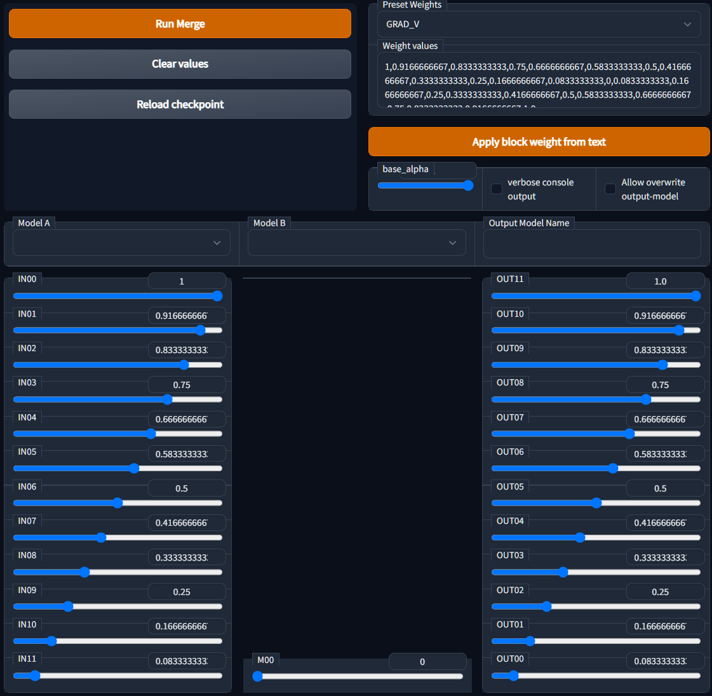

## Table of contents

<!--ts-->

* [How to Install](#how-to-install)

* [How to use](#how-to-use)
  
   * [Select `model_A` and `model_B`, and input `Output model name`](#select-model_a-and-model_b-and-input-output-model-name)
   * [Set merge ratio for each block of U-Net](#set-merge-ratio-for-each-block-of-u-net)
   * [Setting values](#setting-values)
      * [base_alpha](#base_alpha)
      * [Other settings](#other-settings)
      * [Save as half / safetensors](#save-as-half--safetensors) 
      * [Skip/Reset CLIP `position_ids`key value](#skipreset-clip-position-ids-key-value)

* [Other function](#other-function)
  
   * [Save Merge Log](#save-merge-log)

* [Sample/Example](#sampleexample)
  
   * [result (x/y)](#result-xy)
   * [後述1: weight1](#%E5%BE%8C%E8%BF%B01-weight1)
   * [後述2: weight2](#%E5%BE%8C%E8%BF%B02-weight2)

* [Preset's grids](#presets-grids)
  
   * [Examples of Sigmoid-like Functions](#examples-of-sigmoid-like-functions)

* [Special Thanks](#special-thanks)
  
  <!--te-->

## How to Install

- Go to `Extensions` tab on your web UI
- `Install from URL` with this repo URL
- Install
- Restart Web UI

## How to use

### Select `model_A` and `model_B`, and input `Output model name`

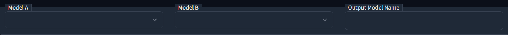

- if checkpoint is updated, push `Reload Checkpoint` button to reload Dropdown choises.

### Set merge ratio for each block of U-Net

- Select Presets by Dropdown
  
  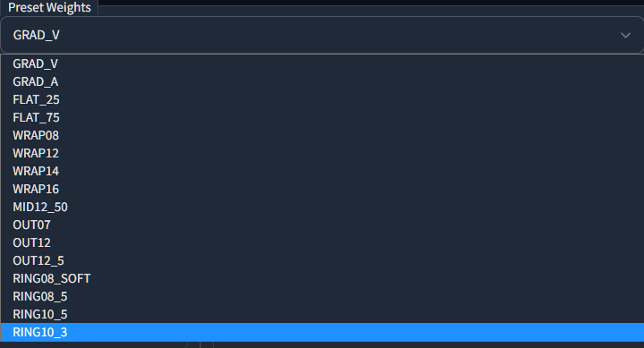
  
  You can manage presets on tsv file (tab separated file) at `extention/<this extension>/csv/preset.tsv`
  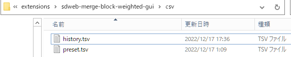

- or Input at GUI Slider

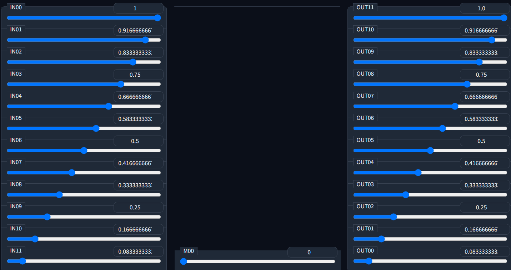

- "INxx" is input blocks. 12 blocks

- "M00" is middle block. 1 block

- "OUTxx" is output blocks. 12 blocks

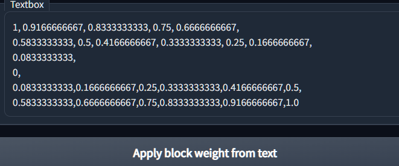

- You can write your weights in "Textbox" and "Apply block weight from text"
  
   - Weights must have 25 values and comma separated

## Setting values

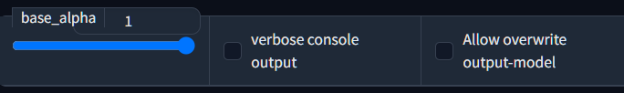

### base_alpha

- set "base_alpha"

| base_alpha |                                                                   |
| ---------- | ----------------------------------------------------------------- |
| 0          | merged model uses (Text Encoder、Auto Encoder) 100% from `model_A` |
| 1          | marged model uses (Text Encoder、Auto Encoder) 100% from `model_B` |

### Other settings

| Settings                     |                                                                |
| ---------------------------- | -------------------------------------------------------------- |
| verbose console output       | Check true, if want to see some additional info on CLI         |
| Allow overwrite output-model | Check true, if allow overwrite model file which has same name. |

- Merged output is saved in normal "Model" folder.

### Save as half / safetensors

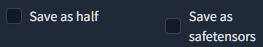

- Settings about save
  
   - "Save as half" mean float16
  
   - "Save as safetensors". If you set your output file ext as `.safetensors`, automaticaly saved as safetensors with/without this setting.

### Skip/Reset CLIP `position_ids`key value


- In this function, you can select treatment of `position_ids` value in CLIP.
- Values in this key controls matching of your prompt and embeddings.
- I've try to found the cause of 'Some model ignore No.1 token(word)' problem, and write some report about that. ([[調査] Smile Test: Elysium_Anime_V3 問題を調べる #3｜bbcmc｜note](https://note.com/bbcmc/n/n12c05bf109cc))
- Arenatemp already have spectation of inside of models, and published Extension to fix this CLIP key problem. See also,
   - [stable-diffusion-webui-model-toolkit](https://github.com/arenatemp/stable-diffusion-webui-model-toolkit)
- MBW is also affected by this problem, because some model may (potensialy) have this issue, and causes/transfer some trouble to merged result model.

| Select | Effect                                                          |
| ------ | --------------------------------------------------------------- |
| None   | do nothing about key. normal merge                              |
| Skip   | Skip `position_ids` key to eject effect. Value of Model A used. |
| Reset  | Replace `position_ids` values to tensor([[range(77)]])          |

## Other function

### Save Merge Log

- save log about operated merge, as below,
  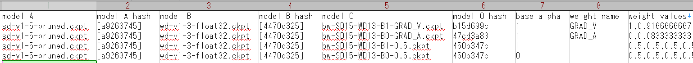

- log is saved at `extension/<this extension>/csv/history.tsv`

## Sample/Example

- kohya_ss さんのテストを再現してみる
  
   - Compare SD15 and WD13 / Stable Diffusion 1.5 と WD 1.3 の結果を見る
      - ※元記事は SD14 を使用 (WD13はSD14ベース)
   - see also [Stable DiffusionのモデルをU-Netの深さに応じて比率を変えてマージする｜Kohya S.｜note](https://note.com/kohya_ss/n/n9a485a066d5b)

- 準備する/マージして作るモデルは、以下の通り / Prepare models as below,
  
  | Model Name      |                                                                   |
  | --------------- | ----------------------------------------------------------------- |
  | sd-v1.5-pruned  | Stable Diffusion v1.5                                             |
  | wd-v1.3-float32 | wd v1.3-float32                                                   |
  | SD15-WD13-ws50  | 通常マージしたもの<br>SD15 + WD13, 0.5 # Weighted sum 0.5                  |
  | bw-merge1-2-2   | Merge Block Weighted<br>SD15 and WD13. base_alpha=1<br>weightは後述1 |
  | bw-merge2-2-2   | Merge Block Weighted<br>SD15 and WD13. base_alpha=0<br>weightは後述2 |

- テスト用のGeneration Info, Seedは 1～4 の4つ
  
  ```
  masterpiece, best quality, beautiful anime girl, school uniform, strong rim light, intense shadows, highly detailed, cinematic lighting, taken by Canon EOS 5D Simga Art Lens 50mm f1.8 ISO 100 Shutter Speed 1000
  Negative prompt: lowres, bad anatomy, bad hands, error, missing fingers, cropped, worst quality, low quality, normal quality, jpeg artifacts, blurry
  Steps: 40, Sampler: Euler a, CFG scale: 7, Seed: 1, Face restoration: CodeFormer, Size: 512x512, Batch size: 4
  ```

### result (x/y)


- 変化傾向は、
  
   - bw-merge1 で、顔立ちがややアニメ化 (sd15-wd13-ws50と比較して)
   - bw-merge2 で、ややリアル風（特に seed=3 の目が良い）

- おおまかに見て、kohya_ss さんの結果と同様の方向性になった。実装は問題ないと判断する

### 後述1: weight1

```
1, 0.9166666667, 0.8333333333, 0.75, 0.6666666667,
0.5833333333, 0.5, 0.4166666667, 0.3333333333, 0.25, 0.1666666667,
0.0833333333,
0,
0.0833333333,0.1666666667,0.25,0.3333333333,0.4166666667,0.5,
0.5833333333,0.6666666667,0.75,0.8333333333,0.9166666667,1.0
```

### 後述2: weight2

```
0,0.0833333333,0.1666666667,0.25,0.3333333333,0.4166666667,0.5,
0.5833333333,0.6666666667,0.75,0.8333333333,0.9166666667,
1.0,
0.9166666667, 0.8333333333, 0.75, 0.6666666667,
0.5833333333, 0.5, 0.4166666667, 0.3333333333, 0.25, 0.1666666667,
0.0833333333, 0
```

## Preset's grids

<p align="center">
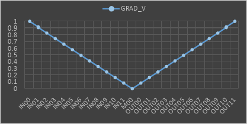 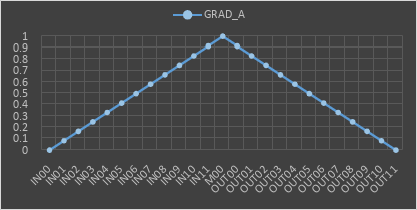 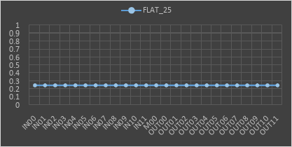 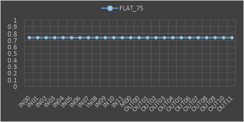 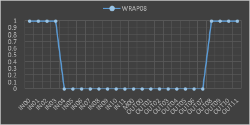 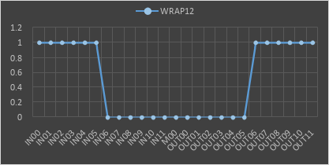 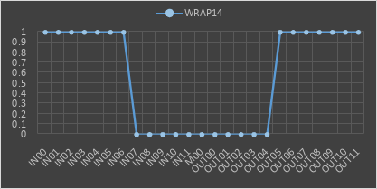  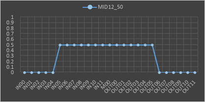 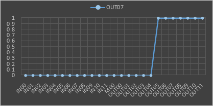 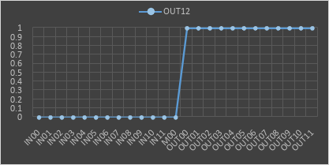 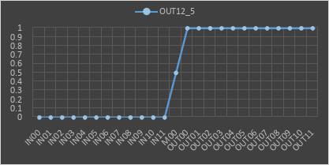 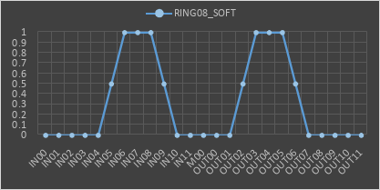 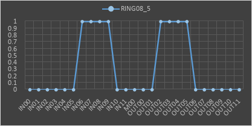 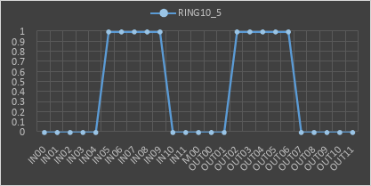 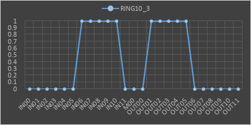 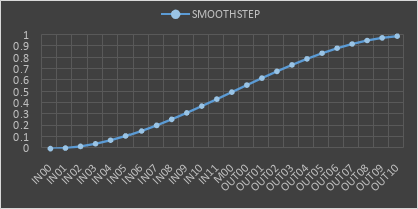 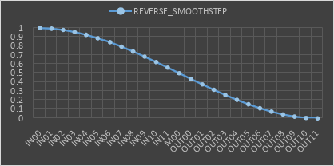 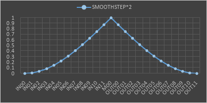 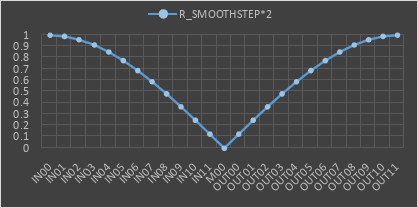 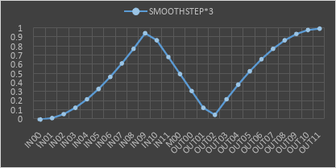 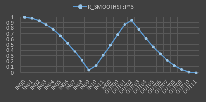 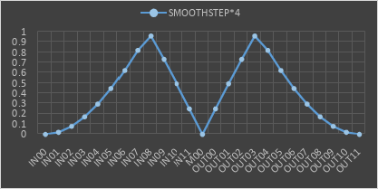 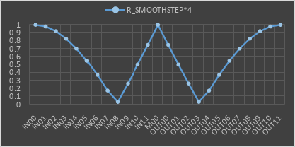 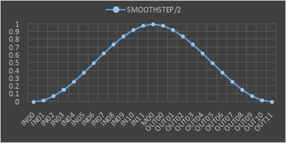 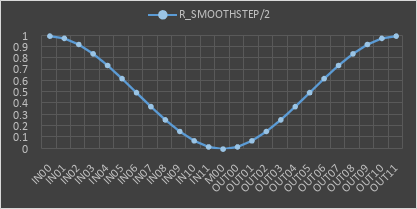 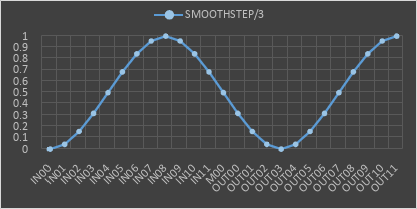 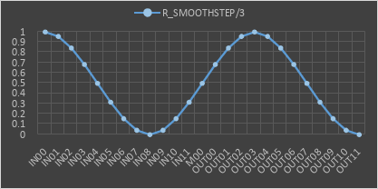 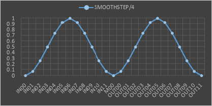 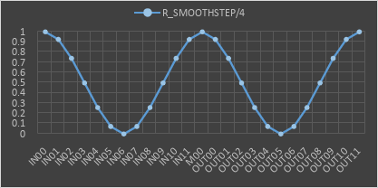 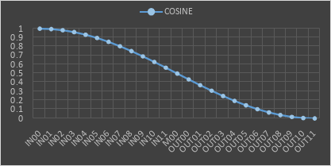 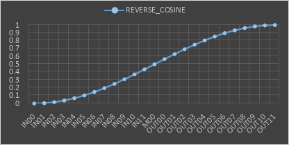 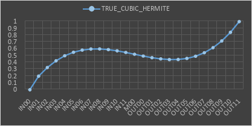 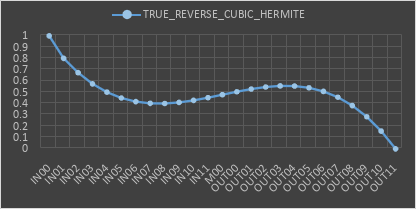 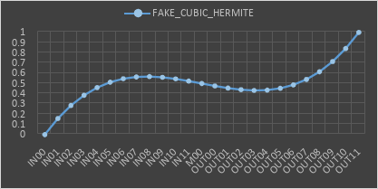 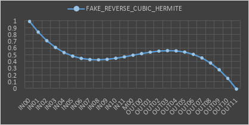
</p>

#### Examples of Sigmoid-like Functions

```
a∈{0;1;2;3;4;5;6;7;8;9;10;11;12;13;14;15;16;17;18;19;20;21;22;23;24}
S=100/24` - Steps
`𝝅` - number Pi
`Q=2` - Ratio
```

| name                 | equation                                                                                        |
| -------------------- | ----------------------------------------------------------------------------------------------- |
| `Cosine`             | `x=a(S)100` & `y=(1-COS((x-1)*𝝅))/2`                                                           |
| `Smoothstep`         | `x=a(S)100` & `y=3x^2-2x^3`                                                                     |
| `Smoothstep*Q`       | `x=a(S)100` & ( when `x∈<0;0.5>` , `y=Q(3x^2-2x^3)` ∨ when `x∈(0.5;1>` , `y=2-Q(3x^2-2x^3` )    |
| `Smoothstep\Q`       | ( when `a<=12` , `x=a(S/Q)100` ∨ when `12<a<=24` , `x=(24-a)(S/Q)100` )  &  `y=3x^2-2x^3`       |
| `True_Cubic_Hermite` | `x=a(S)100` & `y=(2*x₁^3-3*x₁^2+1)*(x₁-xₙ₋₁)+(x₁^3-2*x₁^2+x₁)*S+(-2*x₁^3+3*x₁^2)*(x₁^3-x₁^2)*S` |
| `Fake_Cubic_Hermite` | `x=a(S)100` & `y=(x^3-2*x^2+x)*S+(-2*x^3+3*x^2)*(x^3-x^2)*S`                                    |

## Special Thanks

- kohya_ss, [Stable DiffusionのモデルをU-Netの深さに応じて比率を変えてマージする｜Kohya S.｜note](https://note.com/kohya_ss/n/n9a485a066d5b)
