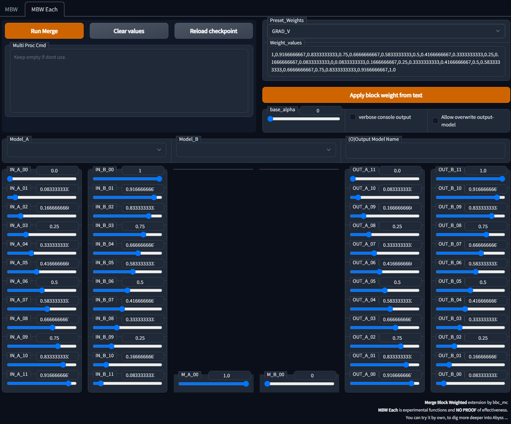

# MBW Each - Experimental

[日本語_eachについて](README_each.ja.md)

- This document is for description of new features of **MWB Each** .
- This new feature is developed for [personal study, publish on "note"](https://note.com/bbcmc/n/n2d4765b4bd47)
- For information about general info as "How to install", go to [README.md](README.md)

**#### This is EXPERIMENTAL ####**



# Additional Features

- [Merge model-A and model-B by your ratio](## Merge model-A and model-B by your ratio)
- [Multi merge command window](## Multi merge command window)
   - [Available variables](### Available variables)
- [Personal Preset File](## Personal Preset File)

## Merge model-A and model-B by RATIO what you want

- merge models with supplied ratio.

- Preset works to Model B ratios, i.e. `IN_B_00`.

- example: if you use IN_A_00: 0.5, IN_B_00:0.3, merge run with equation as, 
  
  ```
  result_IN_00 = 0.5 * model_A_IN_00 + 0.3 * model_B_IN_00
  ```

## Multi merge command window

- You can run multiple merge in sequence, one after the other.

- 1 line represents  1 merge.

- Basically UI settings are used, but you can enter variables only where you want to make changes.

- Variables must be separated from each other by commas `,`.

- Variables are processed by order from before.
  Later specifications will overwrite them.

### Available variables

- available variables shown below,
  
  | keywords         | description                                                                                                                                                                            | sample                      |
  | ---------------- | -------------------------------------------------------------------------------------------------------------------------------------------------------------------------------------- | --------------------------- |
  | O                | Output file name. Subdirectories can be specified. Skip line if there is no directory or if there is a file and it cannot be overwritten. Add `.ckpt` at end of filename if dont exist | O=merge/test03/test-merge   |
  | IN_[AB]_[00-11]  | merge ratio of INPUT block                                                                                                                                                             | IN_A_01=0.12345             |
  | M_00             | merge ratio of MIDDLE block                                                                                                                                                            |                             |
  | OUT_[AB]_[00-11] | merge ratio of OUTPUT block                                                                                                                                                            |                             |
  | Model_A          | model name                                                                                                                                                                             | Model_A=sd-v1-5-pruned.ckpt |
  | Model_B          | model name                                                                                                                                                                             | Model_B=sd-v1-5-pruned.ckpt |
  | base_alpha       | Merge ratio of places which not merged by layer. `A:(1-base_alpha), B:base_alpha`                                                                                                      | base_alpha=0.0              |
  | preset_weights   | Specify weights by preset name. Preset value go into ratio of model B, and 1-B on ratio of model A.                                                                                    | preset_weights=GRAD_V       |

- Command sample
  
  ```
  O=merge/test04/SD15-75-IN_00, IN_A_00=0.75
  Preset_Weights=ALL_A, O=merge/test06/SD15-WD13-2-8-OUT_11, OUT_A_11=0.2, OUT_B_11=0.8, Model_A=sd-v1-5-pruned, Model_B=wd-v1-3-float32
  ```

- tested with 25 merge, one time.

## Personal Preset File

- Add `preset_own.tsv` to save your own preset

- File path is `csv/preset_own.tsv`

- This file is **OUT OF CONTROL OF GIT**, which means do not overwrite with this repository update.

- preset files is loaded as order `preset_own.tsv`, `preset.tsv`

- `preset_own.tsv` needs two column, as below
  
  
